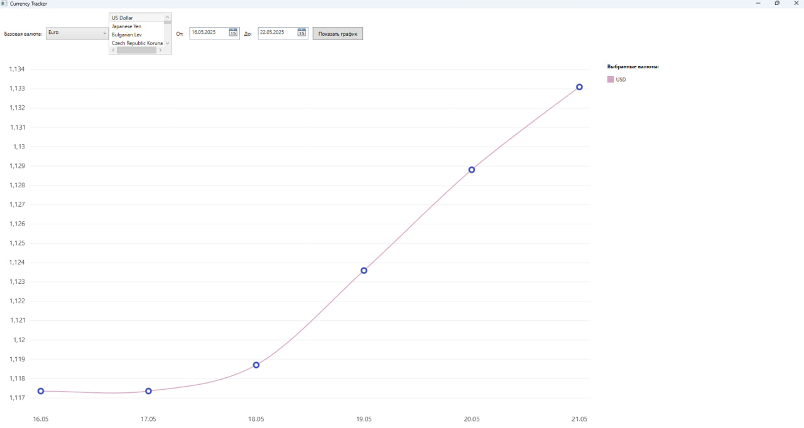

# CurrencyTracker

A simple desktop currency rate tracker built with C# and WPF.

## Features

- Displays available currencies
- Fetches historical exchange rates via external API
- Stores data locally using SQLite
- Plots currency rate charts

## Project Structure

- `Models/` — Data models for API responses and database storage
- `Services/` — Core logic, API clients, and database access
- `Repositories/` — Interface and implementation for storing rates history
- `MainWindow.xaml` — Main application window

## Getting Started

1. Open `CurrencyTracker.csproj` in Visual Studio
2. Restore any missing dependencies if prompted
3. Run the project and explore currency trends

## How application looks?

Ik it's not perfect, but im not c# dev and frontend enjoyer :)